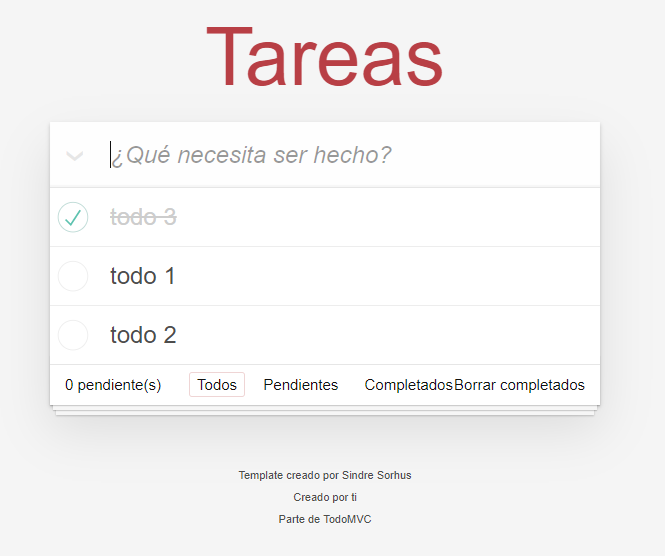

# Todo MVC JS

Este es un proyecto que implementa conceptos MVC que se observan en la mayoría de los frameworks JavaScript más populares de la actualidad.

En este proyecto se hace uso de:
- Webpack
- Babel

Para la capa de persistencia:
- LocalStorage 
- SessionStorage 

### Fuente
[todomvc.com](https://todomvc.com/)

### Notas:
Recordar reconstruir los modulos de Node
```
npm install
```
## Build production
```
npm run build
```

## Build development
```
npm run build:dev
```


